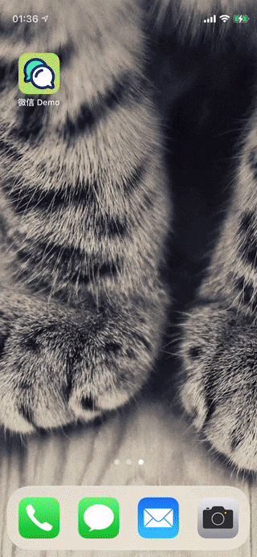

# 用 SwiftUI 五天组装一个微信

## 效果图

## 实装内容
* 4 个 Tab 页面 + 聊天界面，使用纯 SwiftUI 搭建而成
* 应用启动界面 Launch Screen
* 国际化及应用内语言切换功能
* Combine 使用场景（聊天界面简易对话功能）
* 极度简化的 MVVM 架构
* 逻辑部分纯 Swift5 书写，几乎不涉及 OC 类及 UIKit 库
* 不使用第三方框架（除了 SwiftGen 提供便利）

## 难点
* 在聊天界面中隐藏 Tabbar（未能实现）
* 聊天界面中信息滚动功能，尤其动画滑动效果难以实现
* 保持键盘焦点，不自动隐藏（有望在 SwiftUI 3 后实现）
* 发现页图标的动态颜色指定（实现起来障碍较大，多番尝试发现无法简单地将 Color 和 一众渐变色类型 存储到单一变量，并且 View 比较难以扩展，语法糖副作用严重）
* SwiftUI 原生视图难以完美复刻微信原生界面（尤其是联系人页），判断是微信使用了大量自定义视图
* Tab 按钮添加红点（无法实现，SwiftUI 原生视图仅接受 Image 和 Text，对 Modifier 的修改直接忽略）
* SwiftUI 中 Combine 的使用（通过 ObservableObject 构造 ViewModel 实现）
* 应用内语言切换（通过 [自定义配置 SwiftGen](https://github.com/wavky/SwiftGenConfigForSwiftUI) 实现）

## 坑
* SwiftUI2 中缺乏视图焦点控制方法（该部分将在 SwiftUI3 中提供）
* SwiftUI 中使用 switch 语法时，会导致自动提示失效，但编译能顺利通过，判断是 Xcode 问题
* 目前在书写 SwiftUI 时遇到语法使用错误等情况，偶尔会出现 Xcode 提示未知错误，建议报告 bug（因为逐行书写，基本都能猜出问题所在）

---

## 彩蛋
应用内包含微信联系方式，欢迎同行交流（本人是 Android 攻城狮..）
